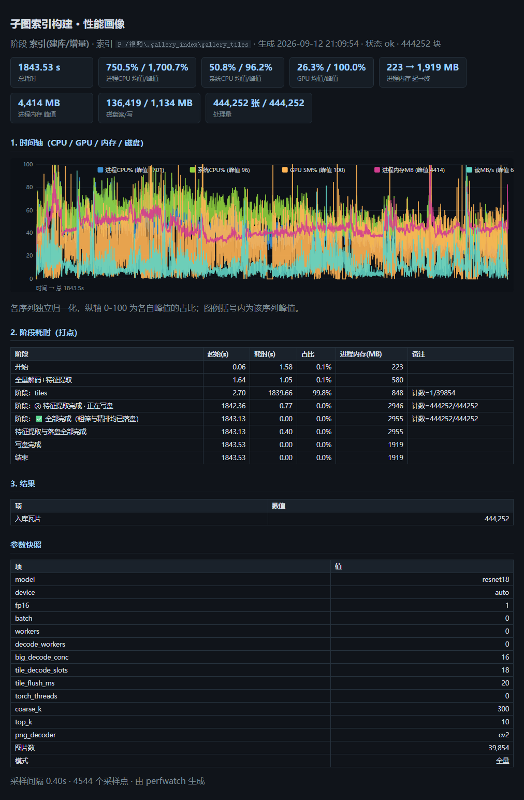
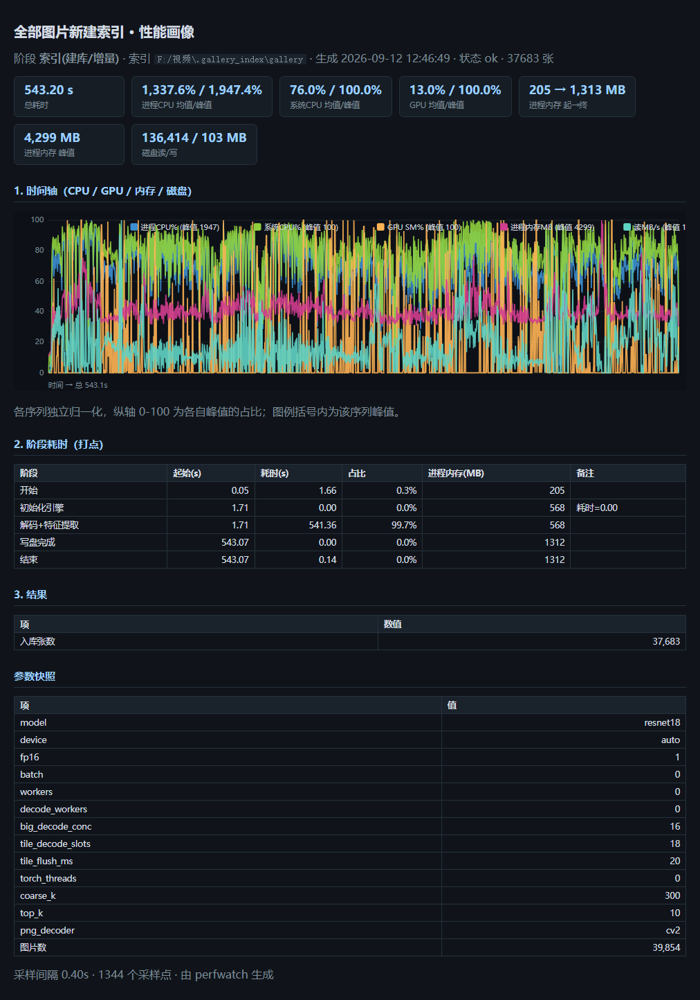
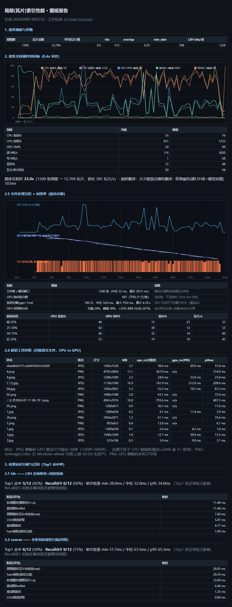

# 二值法粗筛 + ResNet 精排 —— 混合图库检索系统

针对“相似性图像对比为主要判别依据”的本地图库，实现 **两级漏斗式检索**。
提供两种使用方式：**可视化界面 `gui.py`**（推荐日常使用）与命令行 `main.py`。

> 许可证：**AGPL-3.0**（GNU Affero General Public License v3.0）——见 [LICENSE](LICENSE)
> 与文末「开源协议」（2026-09-12 由 MIT 变更）。

```
查询图片
  │
  ▼
┌─────────────────────────────────────────────────────────┐
│ 阶段 1 · 二值法粗筛（纯 CPU，毫秒级）                     │
│   灰度 → 高斯降噪 → 64×64 → OTSU 二值化                  │
│   ├ 特征 A：最大轮廓 Hu 矩（7 维，旋转/缩放/平移不变）    │
│   └ 特征 B：二值图像指纹（4096 bit 汉明距离）            │
│   两路距离按 k 近邻基准归一后加权融合                     │
│   输出：相似度 top coarse_k（默认 300）张候选             │
└──────────────────────┬──────────────────────────────────┘
                       ▼
┌─────────────────────────────────────────────────────────┐
│ 阶段 2 · ResNet 精排（语义特征）                          │
│   resnet18(512维)/resnet50(2048维) 去分类头 → L2 归一化   │
│   方式A：有全库索引 → 按行号取特征 → 余弦一次算完          │
│   方式B：无全库索引 → 仅对候选实时批量抽特征               │
│   输出：最终 top_k（默认 10）                             │
└─────────────────────────────────────────────────────────┘
```

## 性能速览（本机实测）

> 测试机：14 核 20 线程 / 16GB 内存 / RTX 4060 Laptop / TiPlus7100 SSD。
> 真实图库 `F:\视频`：**39,854 个图片文件 → 整图索引 37,683 张 + 瓦片索引 444,252 块**
> （同内容多副本按 MD5 去重，故入库数少于文件数），索引为侧车 `.npy` 格式。

| 场景 | 实测结果 |
| :--- | :--- |
| **整图全量建库（37,683 张）** | **543 s → 69.4 张/秒**（CPU 12.7 核，单遍解码出粗筛+ResNet） |
| **瓦片全量建库（39,854 张 → 444,252 块）** | **1843.5 s → 21.7 张/秒 · 241 块/秒**（CPU 7.5 核 / GPU 均值 26% / 写盘 1.17 s） |
| 整图索引加载（37,683 张） | **0.09 s** |
| 整图检索（库 37,683 张，热态） | **125 ms / 次**（中位数；首查含模型加载 2.8 s） |
| 瓦片索引加载（444,252 块） | **0.71 s** |
| 局部（瓦片）检索（444k 块） | **2.2 s 首查**（含模型加载 + LSH 建表 ~1.9 s）→ 引擎常驻后 **~1 s / 次** |
| 局部命中精度（靶子＝整图横切 24%） | Top1 命中原图，**余弦 0.9987**，命中框 (1045,384)-(1557,896) |
| 重复图查验（42,414 张，阈值 2%） | **89 s** → 6,899 组 / 23,906 张 / 可释放 **72.9 GB** |
| 审查窗口（2.4 万行） | 构建 **0.5 s**；冷启动首屏 **0.7 s**；二次打开 **<0.1 s**；内存 **~110 MB** |
| 大图对比（24 MP） | 缩放 **~21 ms / 次**；停手精排 **~8 ms / 次** |
| 融合建库吞吐（真实 24MP 图，GPU） | **348 张/秒**（首建，单遍解码出粗筛+ResNet） |
| 重复建库（预处理缓存命中） | **860 张/秒**，CPU 380→5 ms/张（1500 张实测，索引逐位一致） |
| 索引常驻内存 | 444k 瓦片库 **+76 MB**（旧 npz 格式为 +1.18 GB） |

> 两次全量建库的完整时间轴见下节「性能图」；瓦片建库的耗时大头是**每张图必须完整
> 解码一次**（要 512px 瓦片，无法复用 224 预处理缓存）——按 346 ms CPU/张 拆分，
> 解码约 150~250 ms、13 块 ×（指纹/PIL 预处理 ~5 ms + 逐块 MD5 ~4.6 ms）。
> 已知的命中框坐标系偏差见「已知问题」。

复现命令：`python devtools/bench_real_index.py`、`python main.py bench <目录> --limit 400`、
`python devtools/dedup_scan_real.py F:\视频`、`python devtools/verify_thumb_perf.py`、
`python devtools/verify_tile_index.py "F:\视频\.gallery_index\gallery_tiles" --root F:\视频`。

## 性能图：本机实测报告（整页渲染 + 原始 HTML/JSON）

下面几份都是**真实任务导出**的报告（GUI 勾选「索引阶段导出性能图」，或
`perfscope.py` / `devtools/` 脚本生成）。图是报告的整页截图（Chrome 无头渲染，
按 GitHub 正文宽度 1012px 出图，1:1 显示）；点链接可看原始 HTML 与逐 0.4s 采样 JSON。
GitHub 不执行 HTML，**想在线看可交互渲染版**用 raw.githack 链接。

### ① 瓦片索引全量建库 · 444,252 块（2026-09-12）



- [原始 HTML](docs/perf/tiles_full_build_20260912.html) ·
  [原始采样 JSON](docs/perf/tiles_full_build_20260912.json) ·
  [在线渲染版](https://raw.githack.com/zccored/ImageSearchTool/main/docs/perf/tiles_full_build_20260912.html)
- 场景：`F:\视频` 39,854 张 → 444,252 块；提取阶段 1839.7 s + 写盘 1.2 s（共 1843.5 s）。
- 读数：CPU 均值 **7.5 核**（P90 10.3）、GPU 均值 **26%**（≥75% 的采样仅 1%）、
  读盘均值 **74 MB/s**（NVMe 远远未饱和）、RSS 峰值 4.4 GB/16 GB。
- 结论：**CPU 供给受限（解码占大头），不是 IO/GPU 瓶颈**；逐 10% 分段时间
  17.5→28.2 张/秒，**无长尾衰减**，<3 核的"空窗"采样仅 0.2%。

### ② 整图索引全量建库 · 37,683 张（2026-09-12）



- [原始 HTML](docs/perf/full_build_20260912.html) ·
  [原始采样 JSON](docs/perf/full_build_20260912.json) ·
  [在线渲染版](https://raw.githack.com/zccored/ImageSearchTool/main/docs/perf/full_build_20260912.html)
- 场景：单遍解码同时产出粗筛指纹与 ResNet 输入；**543.2 s → 69.4 张/秒**。

### ③ 瓦片建库基准（无界面 · 优化前后对照，2026-09-09）



- [原始 HTML](docs/perf/tiles_benchmark_20260909.html) ·
  [在线渲染版](https://raw.githack.com/zccored/ImageSearchTool/main/docs/perf/tiles_benchmark_20260909.html)
- 场景：1,500 张 / 12,704 块的实验样本，两级任务池改造后 **86 → 385 块/秒**。
- 这份报告章节最全：逐文件解码窗、逐批前向"锯齿/空窗"诊断、解码器对照。

> 报告格式说明：`perfscope.py`（只读观测仪，章节最全）与 `perfwatch.py`（GUI 内
> 阶段画像，每 0.4s 采样一行）输出同源 HTML；`perf_reports/*.json` 是逐行原始采样，
> 可自行画图或做 A/B 对比。仓库里收录的是上面三份历史基线，日常跑出来的新报告
> 仍默认写在本地 `perf_reports/`（已在 `.gitignore` 中）。
>
> 上面 raw.githack / htmlpreview 这类在线渲染服务**仅对公开仓库有效**；私有仓库请把
> HTML 下载到本地双击打开（浏览器直接渲染），或启用 GitHub Pages 后访问
> `https://<用户名>.github.io/ImageSearchTool/perf/<文件名>.html`。

## 〇、可视化界面（日常使用推荐）

```bat
python gui.py
```

界面操作流（左侧两页参数、右侧列表与检索页、底部日志/进度条）：

1. **自定义图库位置**：顶部输入框直接填目录，或点“浏览…”选择；
2. **扫描图库**：点“扫描图库”递归遍历目录内全部图片，兼容
   jpg/jpeg/png/bmp/tif/tiff/webp 等格式（“建库参数-图片格式”可增删，如加 gif），
   可选“校验可解码(慢)”把损坏文件剔除；扫描后列表显示每张的大小与格式统计；
3. **选图索引**：
   - “① 全部入库并建索引” —— 第一次使用选这个；
   - “② 仅索引勾选的图片” —— 在列表里 Ctrl/Shift 多选若干张后点它；
   - “③ 增量入库” —— 之后目录里新增的图片一键补进索引（路径+MD5 自动去重）；
   - “查验去重” —— 找出图库里“一对多”的重复图（见下）；
   - “刷新已索引标记” —— 列表第一列 ✔/· 标记哪些已在索引内；
   - 双击列表任意图片 = 设为查询图；
4. **参数微调**：两页输入控件——建库参数（指纹边长、高斯模糊核、Hu矩/指纹权重与开关、
   白多取反、ResNet 模型/设备/批大小/FP16/是否预建全库索引/去重/并行线程/图片格式），
   检索参数（粗筛候选数 coarse_k、返回数 top_k、剔除自身、索引前缀）；
   校验通过才生效，改错会弹窗提示；
5. **以图搜图**：在“以图搜图”页填/选查询图 → “开始检索”→ Top-K 缩略图网格；
   点选格子看命中详情，可一键“打开原图 / 复制路径 / 导出总览图”。
   缩略图无法生成时（超大 PNG/WebP、解码失败）会显示**占位格子**而不是直接跳过——
   保证格子与命中一一对应（点哪张就是哪张），结果区始终排满 Top-K。

### 处理过程可视化（窗口左下角面板，24fps）

建索引时，日志区左侧的“处理过程可视化”面板会实时播报数据真正在流经系统：

- **① 粗筛阶段**：每帧 = 正在处理的一张图经过
  “灰度 → 降采样 → OTSU 二值化”后的 **64×64 激活点阵**（荧光点即指纹 0/1 散点），
  画面逐帧切换表明每一张图都被实况采样；
- **② ResNet 阶段**：粗筛画面在原位被覆盖为 **16×16 采样象限图**——
  每帧 = 当前图片“中心 224×224 采样窗口”降采样成的彩色马赛克，
  对应 ResNet 真正截取做语义分析的内容；
- 两者都以 **24fps 上限** 刷新（数据源可能更快，中间帧自动丢弃、突发帧自动摊平），
  面板状态行显示当前阶段与已绘制帧数；任务结束保留最后一帧。

性能保障：数据通道是可选回调（GUI 外零开销），worker 线程只做“把一帧小图入队”；
解码/前向/进度统计全部不受影响，绘制由主线程按 24fps 节流执行，单帧绘制亚毫秒级。

> 提示：与索引几何强相关的参数（指纹边长/模糊核/Hu·指纹开关/取反）在建库后修改，
> 检索时会因“参数与索引不一致”被拒绝，需重新“① 全部入库”重建——这是防错乱设计；
> 权重、coarse_k、top_k、剔除自身等可随时微调。

### 性能图导出（可选，默认关）

“建库参数/检索参数”页各有一个开关：**索引阶段导出性能图** / **搜图阶段导出性能图**。
勾选时会弹一次“有性能损耗”提示（采样 0.4s 一次，开销 <1%，但报告占磁盘）；
任务结束即在 `perf_reports/gui_<阶段>_<时间>.html`（+同名 `.json` 原始采样）生成报告，
内容含：CPU/GPU/内存(RSS)/磁盘读写时间轴、阶段打点耗时表、参数快照。
工具栏 **📈 最近性能图** 一键打开最新报告。

配套两个内存工具：

- **🧹 释放索引内存**：清掉已缓存的索引引擎（含 mmap、LSH 表），并 `gc` +
  `torch.cuda.empty_cache()`；日志给出 RSS 回落量。
- 引擎缓存策略：同一（索引前缀 + 关键参数）只加载一次，因此**重复搜图不再重新
  加载索引**（444k 瓦片库实测：冷启动 6.2 s → 热检索 **0.47 s**）；建库前会自动
  释放缓存腾内存，索引被改写或参数变化时缓存自动失效。

### 预处理缓存（L2 内存 + L3 磁盘）：解决“CPU 喂不饱 GPU”

**先看实测**：融合建库 400~1500 张真实图，**CPU 侧 100~380 ms/张，而 GPU 前向只要
0.41 ms/张**——GPU 利用率仅 8~19%、空窗 70%+ 的根因是 **CPU 供给不足**（解码占大头：
PNG 无法域缩放、大 JPEG 熵解码占主导），**不是显存或 IO 调度问题**（因此三级缓存里
“显存 L1 预取”帮不上忙）。

真正有效的是缓存**预处理结果**，让重复建库完全跳过读盘与解码：

| 缓存内容（键＝绝对路径 + 文件大小 + mtime） | 说明 |
| :--- | :--- |
| ResNet 输入（PIL 处理后的 224×224 裁剪） | **PNG 无损 ≈70 KB**，命中后解码+归一化 ≈1.5 ms |
| 粗筛特征：打包指纹 512 B + Hu 7×f32 | 直接复用，无漂移 |
| 内容 MD5 + 预处理签名（模型/尺寸） | 签名不符视为未命中，换模型不会读到旧产物 |

实测（`python devtools/verify_prep_cache.py 1500`，1500 张真实图）：

| | 冷建库（空缓存） | 热建库（命中缓存） |
| :--- | ---: | ---: |
| 耗时 | 44.4 s | **1.7 s（25.6×）** |
| 吞吐 | 34 张/秒 | **860 张/秒** |
| CPU | 566 s（12.7 核，380 ms/张） | **7.3 s（4.2 核，5 ms/张，省 99%）** |
| GPU 利用率 | 7.9% | 26.3% |
| **索引一致性** | — | **Hu / 指纹 / 精排特征逐位一致**（余弦偏差 2.4e-07） |

- 开关：`cfg.prep_cache=True`（默认）、CLI `--no-prep-cache`、GUI 建库参数页
  「启用预处理缓存(重复建库更快/占磁盘)」；缓存位于 `<索引目录>/prep_cache/`，
  约占 **70 KB/张**（3.7 万张 ≈ 2.5 GB），删掉该目录即清空。
- 生效场景：**重建整图索引、改参数重算、build-fine、重复图查验**（后两者也走缓存）。
  首次全量建库仍需完整解码（这是填充缓存的唯一代价，多约 12% CPU）。
- 瓦片索引另需一次整体解码（要 512px 瓦片，无法用 224 裁剪复用），暂未纳入缓存。
- 复现脚本：`devtools/verify_prep_cache.py`、`probe_cpu_cost.py`（单张成本分布）、
  `probe_pipeline_split.py`（生产/消费端占比）、`probe_decode_threads.py`（线程扩展性）、
  `probe_cache_exact.py`（缓存格式选型）。

### 索引存储格式：npz 与“侧车 .npy”

- 旧格式 `<前缀>.coarse.npz / <前缀>.fine.npz`：npz 成员**无法 mmap**，
  打开时必须整体解压进内存（444k 瓦片库实测 **3.1 s / 常驻 +1.18 GB**）。
- 新格式（侧车）：大数组拆成可 mmap 的 `.npy`
  （`paths/md5s/hu/fp/boxes/hu_stats/fine/fine_paths`），meta 里标记
  `"storage": "sidecar"`。实测：**444,189 块瓦片库打开 0.71 s（4.4×）、常驻内存
  +76 MB（省 1.1 GB）；37,683 张整图库打开 0.09 s**，检索结果完全一致；
  读取异常或行数不符时自动回退旧 npz。
- 就地转换已有索引：

```bat
python main.py compact --prefix "F:\视频\.gallery_index\gallery_tiles"
python main.py compact --prefix "F:\视频\.gallery_index\gallery"        :: 幂等
python main.py compact --prefix <前缀> --delete-legacy                 :: 顺手删旧 npz
```

  GUI 里等价按钮为工具栏 **⏩ 优化索引存储**（同时处理整图与瓦片两套索引，
  旧 npz 默认保留可回退）。新建索引用 `--fast-load`（或“建库参数”页
  “新索引用侧车 .npy 存储”勾选）直接写成新格式。

### 局部（瓦片）索引与混合检索

整图索引只能回答“哪张图整体像它”；当查询图是**某张图的一部分**（裁切、局部、拼图一角）
时，整图会被缩到 224 而与被查图里的细节尺度错配，正确原图往往排不进来。为此增加了
**瓦片（局部）索引**：把每张图按 **512px + 25% 重叠**切成瓦片单独建索引，小图
（较短边 < 768）整块入库。

```bat
:: 建瓦片索引（与整图索引并存于 .gallery_index 下）
python main.py build-tiles "F:\视频" --prefix "F:\视频\.gallery_index\gallery_tiles"
python main.py add-tiles   "F:\视频" --prefix "F:\视频\.gallery_index\gallery_tiles"

:: 检索：tiles=只搜瓦片；hybrid=整图+瓦片并搜（按原图去重、取两路较高分，返回 ≤20 条）
python main.py search "局部截图.png" --mode tiles  --tiles-prefix "F:\视频\.gallery_index\gallery_tiles"
python main.py search "局部截图.png" --mode hybrid --prefix "F:\视频\.gallery_index\gallery"
```

GUI 里等价操作为工具栏 **④ 子图索引(512 切块·建/增量)**，检索页有
**整图 / 局部 / 混合** 三种模式单选（混合模式首次会提示性能损耗）。

要点：

- **查询侧也会切块**：查询图 ≥768 时按同一协议切块，逐块取候选后按“原图”聚合
  （任一块与任一瓦片的余弦取最大），再对聚合出的原图做全瓦片 × 全部查询块的矩阵精排，
  避免 LSH 漏行；小查询自动退回单块路径。
- **结果带命中框**：命中项返回命中框（缩略图叠加红框），详情栏显示
  `命中框 (x0,y0)-(x1,y1)`；命中类型标注 `局部 / 整图 / 双`。
  > ⚠️ **已知偏差**：长边 >2560 的 JPEG 解码时会做域缩放（1/2、1/4、1/8，见
  > 「硬件利用与基准」），库内框存的是**缩放后坐标系**，而 GUI 用文件名义尺寸换算
  > → 这类图（本图库实测占 **53.2%**）的红框会按 1/2 或 1/4 偏位；长边 ≤2560
  > 的图不受影响。**检索本身不受影响**（查询图走同一条解码路径，尺度一致）。
  > 自检脚本：`devtools/verify_tile_index.py`，详见「已知问题」。
- **性能**（444,252 块瓦片库、RTX 4060 Laptop）：索引加载 **0.71 s**；首个查询含
  ResNet 模型加载 + LSH 建表（~1.9 s）合计 **2.2 s**，引擎常驻后 **~1 s / 次**；
  全量建库 39,854 张 → 444,252 块耗时 **1843.5 s（21.7 张/秒 · 241 块/秒）**；
  靶子用例（整图横切 ~24% 高度）Top1 命中原图、余弦 **0.9987**、
  命中框 (1045,384)-(1557,896)。

### 查验去重（找“一对多”重复图）

工具栏“查验去重”按钮：先问一次近似阈值（默认 2%，可调 0.2%~20%），然后扫描当前
图库并弹出审查窗口。两类重复分开标注：

- **完全重复**：文件内容 MD5 相同（字节一致），删哪张都不损失画质；
- **近似重复**：64×64 二值指纹汉明距离 ≤ 阈值（重编码/缩放/换格式/加水印），
  组内显示每张与“保留候选”的汉明距离与 ResNet 余弦，便于人工判断。
  阈值别开太大：4%~10% 会把画师“差分图”（A-01…A-14 这类刻意近似变体）也并组。

速度来自复用索引：已入库图片的 MD5/指纹/特征直接从索引读（不重新解码），
只有未入库文件才读盘解码；条带（band）阻塞 + 汉明复核把比对从 O(N²) 降到
近线性。实测 F:\视频（42,414 张，2% 阈值）：**89s 出结果，6,899 组 / 23,906 张 /
可释放 72.9GB**，峰值内存 115MB。命令行只读版：
`python devtools/dedup_scan_real.py F:\视频`。

审查窗口（每组第一张为默认“保留候选”：像素最多 → 体积最大 → 最新）：

| 操作 | 说明 |
| :--- | :--- |
| 点击成员行 | 切换 ☑/☐（☑ = 将被处理） |
| 点击组标题行 | 该组“保留最佳、其余全选/全不选”切换 |
| 每组保留最佳，其余全选 | 一键把所有组标记为“留一张、删其余” |
| 仅选完全重复(字节相同) | 只勾选字节一致的副本，最保守 |
| 一键选中：MD5相同且未入库 | 入库的那份是“正本”，只勾选未入库的字节级副本（最安全的清理）；命中常散落在几千组里，选中后会自动切到“只看含勾选的组” |
| 显示组数 | 大报告默认只列空间最大的 500 组（可切 100/1000/全部） |
| 只看含勾选的组 | 只显示有勾选的组（忽略显示组数上限），便于核对一键选中的结果 |
| 删除选中(回收站) | 移入 Windows 回收站（可还原）；不做不可逆删除 |
| 移动到… | 选择目标图库位置，保留相对目录结构，重名自动加后缀 |
| 同步从索引移除… | 默认勾选：删除/移动后立即重写索引剔除这些条目（整图 + 瓦片） |

> 缩略图性能：实测 24~27MP 的 JPEG 单张解码约 120ms（熵解码占主导，JPEG 的
> `draft` 降采样只能省一半），若在主线程解码会直接卡死界面。因此改成
> **磁盘缩略图缓存 + 后台线程解码**：缓存写在 `<索引目录>/thumbs/<前2位>/<md5>.jpg`
> （96px，约 5KB/张，同一内容多份副本共用一张），命中后每张读取 <2ms；
> 未命中的交给 3 个后台线程解码（界面不阻塞），失败行显示“无预览”占位图；
> 滚动停住 2.5s 后自动释放显示范围以外的缩略图（实测持有 164 → 61 张、
> 内存回落）。实测 2.4 万行窗口：**构建 0.5s、冷启动首屏 0.7s 填满、
> 二次打开 <0.1s、浏览内存 ~110MB**。

### 大图对比预览（双击任意一行）

双击审查窗口里的任意一行（组标题也行）打开对比窗：

- 黑底窄边框、可 **F11 无边框全屏**；左/右两个展示区各放一张图，**各自独立缩放**
  （滚轮以光标为锚点、中键拖动平移、双击复位）；缩放用**分层采样源**（适应画布的
  预览层 / 1/4 / 1/2 / 原图，只允许向下采样），交互中用 BILINEAR、停手 200ms 后
  自动补一帧 LANCZOS——实测 24MP 图 **稳态缩放 ~22ms/次、高质量重绘 ~8ms/次**
  （优化前 150ms+/次）；
- 最右侧是**当前组的纵向小图栏**（约 296px 宽，滚轮/滚动条可滑动），每张小图带
  **复选框，与审查窗口的勾选双向联动**；信息分四行完整显示：文件名 / 尺寸·体积 /
  汉明·余弦 / 字节相同·已入库；
- 单击小图 → 载入左展示区；把小图**拖到左/右任意展示区**，或把左区的图
  **拖到右区**（右区作为临时对比槽）；拖动时目标区边缘高亮，跟随光标的
  小缩略图指示拖动内容；
- 单击某个展示区 → 该区成为“活动图”（边框高亮，小图栏对应项同步高亮）；
- **Esc**：全屏时先退出全屏，再按一次关闭**所有**对比预览窗。

> 安全设计：组内“链式传递”（A~B~C 但 A 与 C 不相似）会在组标题标 ⚠ 并在
> 删除确认里单独计数；删除数量 >500 张时也会额外提醒先小批量试。
> 缩略图只解码当前可见行（实测 2.4 万行窗口 2.8s 打开、内存 115MB）。

## 〇·五、只读图库观测仪 perfscope.py（不写图库）

在不改动图库任何文件的前提下，扫描档案、分层抽样实测解码效能、
做一次小样本融合建库并采样 CPU/GPU 时间轴，最后生成 HTML“图纸报告”：

```bat
python perfscope.py F:\视频                 :: 全流程（扫描档案缓存后可秒复用）
python perfscope.py F:\视频 --scan-only     :: 只做档案分布
python perfscope.py F:\视频 --no-fused      :: 跳过 GPU 时间轴
python perfscope.py F:\视频 --rescan        :: 强制重扫（忽略缓存）
```

报告含：真实格式/分辨率档/大小档/解码档位分布、按(格式×分辨率档)的实测解码
耗时矩阵与 16 线程折算吞吐、融合建库期间 CPU%/GPU%/显存/img/s 时间轴折线，
以及数据驱动的修改建议（只出方案，不自动改动）。中间产物全部写在工作目录
`perf_reports/`（含 `scan_cache_*.json`，同图库二次观测直接复用，秒级进入采样）。

## 〇·六、与 img_server 的自动交接（下载完成 → 增量建库）

img_server（下载方）完成下载与哈希校验后，在其 UI 按按钮：
写 `request_*.json` → 启动过渡进程 → img_server 及上级主程序退出 →
自动打开本管理器并增量建库（校验 + 路径/MD5 去重，全程可视），
完成后写 `result_*.json` 回审计目录。

- 协议全文：`docs/HANDOFF_PROTOCOL.md`
- img_server 侧接入需求（可直接交给对方智能体）：`docs/img_server_接入需求.md`
- 本侧组件：
  - `handoff_launcher.py`：过渡进程（等待 img_server 退出 → 打开 GUI）
  - `hybrid_search/handoff.py`：request 校验 / 图库根自动定位 / 增量执行 / result 回写
  - GUI 自动模式：`python gui.py --auto-handoff <request.json>`
  - CLI 无界面模式：`python main.py ingest <request.json>`
- **图库根自动定位**：请求 roots 是图库根下的子目录（如新下载批落在
  `F:\视频\<子图集>`）时，自动沿祖先目录向上找到含 `.gallery_index` 的
  图库根，把新图增量并入既有索引，不会在子目录里另建一套；
  `prefix` 留空即启用该行为（详见 `docs/HANDOFF_PROTOCOL.md` §4.5）。
- 无参启动 GUI/CLI 行为与平时完全一致（不影响正常打开与处理流程）。

## 〇·七、切换启动全栈图库管理器（两套程序互切）

工具栏第 4 行的 **“⇄ 切换启动：全栈图库管理器”** 按钮用于与本管理器
互切：img_server 侧按钮是“关全栈管理器 → 打开本管理器”，本按钮是反向的
“关本管理器 → 打开 `D:\code\新的代码\全栈图库管理器 v3.2bata\main.py`”。

激活门槛（任一不满足 → 按钮禁用，旁边给出原因）：
1. **建库/检索等后台任务运行中**（busy）→ 禁用，任务结束自动恢复；
2. 绝对路径下必须真实存在 `…v3.2bata\main.py` —— 本管理器作为**独立数据包**
   分发到其它位置/机器时路径上不存在该文件，按钮保持禁用；
3. **内容哈希校验**：main.py 的 SHA256 必须与本包 `peer_manifest.json`
   登记的白名单一致（当前为 2026-08-08 版 `1E0E1A5F…F6F77`）。
   内容被改动/被植入后门 → 哈希矛盾 → 禁用并显示新旧哈希；
   官方升级后可点 **“校验/信任…”** 人工核对后重新登记（登记留痕时间）。

实现：`peer_launcher.py`（校验/登记/独立进程启动；`python peer_launcher.py
check|register|launch` 可命令行调用）+ GUI 按钮。目标用 **python.exe + 独立
最小化控制台**启动（**不能用 pythonw**：全栈管理器每秒刷新 GPU 性能、内部
反复 spawn nvidia-smi 等控制台子进程，无控制台的父进程会导致窗口每秒弹窗
抢前台；也不能把控制台完全隐藏，实测会卡住其 Qt 主窗口）；2 秒存活探测
通过后才关闭本程序；启动失败会保留本程序并给出 stderr 尾部原因。
main.py 启动后会弹**启动确认框**（人工点击后才进主程序）——属预期，
点确认即可；此前把等待该确认误判为“卡死”的形态（SW_HIDE）勿再使用。

## 一、快速开始（5k 张模拟测试）

```bat
:: 1) 装依赖（精排需要 torch/torchvision，CUDA 版命令去 pytorch.org 生成）
pip install -r requirements.txt
pip install torch torchvision

:: 2) 生成 5000 张模拟图库 + 60 张查询（近重复分组，文件名带 g<组号>）
python make_test_dataset.py --out ./test_data --db 5000 --per-group 8 --queries 60

:: 3) 构建索引（粗筛 + ResNet18 全库特征；4060 笔记本约 20~40 秒）
python main.py build ./test_data/db --prefix ./test_data/gallery

:: 4) 以图搜图（输出 Top-10，可保存总览图）
python main.py search ./test_data/queries/q_g00000_v0.jpg --prefix ./test_data/gallery
python main.py search ./test_data/queries/q_g00000_v0.jpg --prefix ./test_data/gallery --save top10.png

:: 5) 批量召回率评估（验证系统效果）
python main.py eval ./test_data/queries --prefix ./test_data/gallery

:: 6) 索引信息
python main.py stats --prefix ./test_data/gallery
```

> 查询图 q_g00000_v0 的真实“答案”是 db 里所有 `img_g00000_*`；
> Recall@k 越高说明粗筛没漏、精排排得越准。

## 二、换成你自己的图库

```bat
:: 首次
python main.py build D:\我的图库\壁纸 --prefix E:\index\wallpaper --model resnet18

:: 之后陆续有新增图片
python main.py add  D:\我的图库\壁纸\2025-06新增 --prefix E:\index\wallpaper

:: 只建粗筛（不预构建 ResNet，省内存，查询时对候选实时抽特征）
python main.py build D:\我的图库 --prefix E:\index\gallery --no-store-fine

:: 之后想补全库精排索引
python main.py build-fine --prefix E:\index\gallery
```

## 三、子命令一览

| 子命令 | 作用 |
| :--- | :--- |
| `build <图库目录>` | 从零建索引（粗筛必建；默认同时预构建 ResNet 全库索引） |
| `add <新增目录>` | 增量入库：路径重复 + MD5 内容重复都会跳过 |
| `build-fine` | 给已有粗筛索引补建/重建 ResNet 全库索引 |
| `search <查询图>` | 两级检索，Top-K 输出（终端表格 + 可选 PNG 总览 + JSON） |
| `eval <查询目录>` | 批量召回率：粗筛窗口命中率 + 最终 Recall@1/5/10 |
| `stats` | 索引统计 |
| `compact` | 旧 npz 索引 → 侧车 `.npy` 快载格式（`--delete-legacy` 删旧文件） |

## 四、关键参数（都有 CLI 开关，`python main.py search -h` 查看）

| 参数 | 默认 | 说明 |
| :--- | :--- | :--- |
| `--prefix` | `./gallery` | 索引前缀，产出 `<前缀>.meta.json / .coarse.npz / .fine.npz` |
| `--coarse-size` | `64` | 二值指纹边长（64=4096bit/张；尺寸需和建库一致） |
| `--blur` | `5` | 二值化前高斯模糊核（奇数） |
| `--no-hu / --no-fp` | 都开 | 关掉 Hu 矩 / 二值指纹这一路特征 |
| `--hu-weight / --fp-weight` | 0.35/0.65 | 两路粗筛距离的融合权重 |
| `--invert-binary` | 关 | 白像素过半时取反（适合白底内容多、极性不一致的图库） |
| `--model` | `resnet18` | resnet18/34/50/101/152；重语义精度可选 resnet50 |
| `--device` | `auto` | auto=有 CUDA 用 GPU；可强制 cuda/cpu |
| `--no-fp16` | FP16 开 | GPU 上关掉半精度 |
| `--no-store-fine` | 预构建 | 不预构建 ResNet 全库索引 |
| `--coarse-k` | `300` | 粗筛候选数（越大召回越稳、精排越慢） |
| `--no-dedup` | MD5 去重 | 关闭内容去重（大图库全量 hash 有 IO 开销） |
| `--workers N` | `0` | 粗筛特征并行线程：0=自动(≤8)，1=串行 |
| `--decode-workers N` | `0` | 精排解码/预处理并行线程：0=自动(≤8)，与 GPU 前向重叠 |
| `--torch-threads N` | `0` | torch 推理线程：0=默认（多数 CPU 上 1 线程最快） |
| `--png-decoder` | `cv2` | PNG 解码器：cv2=libpng 全尺寸（快~1.3x；个别坏 iCCP 文件有零星 stderr 警告）/ pillow=安静较慢 |
| `--limit N` | 无 | 只处理前 N 张（冒烟测试） |
| `--no-exclude-self` | 剔除自身 | 查询图正好在库里时，是否把“自己”从结果中剔除 |
| `--no-progress` | 开 | 关闭实时进度（默认开启，见下节） |

## 四·五、索引进行到哪一步？（融合建库实时进度）

需要 ResNet 全库索引时，系统走 **融合建库**：每条解码流水线把一张图解码一次，
**同时**产出二值指纹（粗筛）与 ResNet 输入张量，CPU 解码与 GPU 前向全程并行；
进度条报告单一融合阶段（decode+粗筛+精排作为一个整体），显示
当前计数/总数、百分比、张/秒、预计剩余时间（ETA）。

**GUI**：底部进度条实时推进，状态栏显示类似
`粗筛+ResNet 融合提取(单遍解码)：1,234/4,940 张（25%）| 812 张/秒 | 预计剩余 4m 12s`；
左下角可视化面板先回放 **① 二值点阵**帧流，播完后原位覆盖 **② ResNet 采样象限**
帧流（各 24fps，任务完成后排队帧继续自然播完）。

**CLI**（build / add / build-fine 均支持）：
- 终端里单行原地刷新（非 TTY 时每 20% 打一行）：

```text
[阶段 1/1] 粗筛 + ResNet 融合提取（单遍解码，CPU/GPU 并行），共 4,940 张
  3,706/4,940 张 (75.0%)  |  825 张/秒  |  预计剩余 1s
```

- 不需要进度输出可加 `--no-progress`。

> ETA 按当前实测吞吐估算（前 0.1s 内显示 `--`）；阶段一旦卡住（解码大图、
> 磁盘慢），张/秒会掉下来、ETA 相应拉长——可用于判断“正常慢”还是“卡死”。

## 五、硬件利用与基准（bench）

融合建库的设计要点（“CPU/GPU 谁也别空等”）：

- **单遍解码**：同一张图只读盘一次、解码一次（过去粗筛灰度一遍 + ResNet
  RGB 一遍 = 双倍 IO 与解码）；解码线程里顺带算完 OTSU/Hu/指纹，
  主线程按批把张量送 GPU——**不再有“粗筛阶段 GPU 空转”**；
- **解码器域缩放（JPEG 大图关键）**：真实照片（12MP+）JPEG 解码不再全尺寸
  解出，解码器直接输出 ~2048 最长边（采样域 1/2/1/4/1/8 缩放）——
  12MP JPEG 单张 52ms → 31ms，大图库建库再快 ~2.3×；
- **PNG 走 libpng（cv2 全尺寸）**：PNG 的域缩放不省时（必须先解完整条
  IDAT 流），真正收益来自解码器实现：OpenCV 捆绑 libpng 比 Pillow 快 ~1.3×，
  且与 Pillow 逐像素一致（实测指纹汉明差 0%、ResNet 余弦 1.0000）；
  代价是个别坏 iCCP 文件的零星 stderr 警告（可用 `--png-decoder pillow` 切回）；
- **解码线程供给**：GPU 场景自动放宽到 ≤20 线程（解码/熵解码每张单核，
  20 核机器全核供给）；CPU-only 场景自动 8 线程（与前向平衡）；
- **cudnn.benchmark**：GPU 场景自动开启，固定输入尺寸下挑选最快卷积内核；
- **纯粗筛**（`--no-store-fine` / `build-fine` 补库）仍走各自单阶段最短路；
- **查库快**：全库特征常驻内存，粗筛扫描与精排打分都是整段向量化运算。

内置基准命令实测你的机器（自动建临时索引，测完自删）：

```bat
:: 粗筛吞吐 / 检索延迟 / ResNet 吞吐一次全测
python main.py bench D:\我的图库\壁纸 --limit 500 --fine-sample 64
```

本机实测示例（20 核 CPU + RTX 4060 Laptop，torch 2.4.0+cu124）：

| 项 | 结果 |
| :--- | :--- |
| **融合建库吞吐（真实图 1,988 张，24MP 级，单遍解码）** | **5.7 s → 348 张/秒**（粗筛+ResNet18 一起出） |
| **粗筛索引吞吐（真实图 400 张）** | **0.37 s → 1,082 张/秒**（含 MD5+解码+二值化） |
| **ResNet18 精排吞吐（GPU，真实图含解码）** | **87 张/秒**（512 维；小图/已解码场景可达 ~270 张/秒） |
| **检索延迟（库 400 张，coarse_k=300）** | **17.5 ms / 次** |
| PNG 解码（Pillow → OpenCV/libpng 全尺寸） | 单张中位 **1.29×**；热态融合链 **1.7×** |
| 12MP JPEG 解码 | 52.4 ms → **31.1 ms/张**（域缩放 1/2） |

> 融合后 200 万张 GPU 全库索引约 1.5~2 小时（按 348 张/秒折算，旧两阶段结构翻倍不止）。
> 想快速安装/升级 CUDA 版 torch，可用国内镜像直链（cu124 示例）：
> ```bat
> pip install ^
>   https://mirrors.aliyun.com/pytorch-wheels/cu124/torch-2.4.0+cu124-cp312-cp312-win_amd64.whl ^
>   https://mirrors.aliyun.com/pytorch-wheels/cu124/torchvision-0.19.0+cu124-cp312-cp312-win_amd64.whl ^
>   --extra-index-url https://mirrors.aliyun.com/pypi/simple/
> ```
> 版本号/平台需匹配（cu121/cu124、cp312、win_amd64），到
> `https://mirrors.aliyun.com/pytorch-wheels/<cu版本>/` 目录下核对文件名。

## 六、内存与规模预估（对照你的 16GB / 4060 Laptop）

| 规模 | 粗筛索引 | ResNet18 全库(512维 fp32) | ResNet50 全库(2048维) | 建议 |
| :--- | :--- | :--- | :--- | :--- |
| 5k 张 | ~3 MB | ~10 MB | ~41 MB | 全开，GPU 建索引 ~15s |
| 10 万张 | ~60 MB | ~200 MB | ~0.8 GB | 全开没问题 |
| 200 万张 | ~1.2 GB | ~4 GB | ~16 GB | **用 resnet18** 或 `--no-store-fine`；粗筛换 faiss 二进制索引；磁盘索引分片 |

> **侧车 `.npy` 格式下这些数字是“磁盘占用”而非“常驻内存”**：数值大数组按需
> 换页（mmap），实测 444,189 块瓦片库（粗筛 232 MB + 精排 868 MB）打开后只多占
> **76 MB** 常驻内存，其余由系统在内存压力下自动回收；旧 npz 格式则要一次性解压
> 进内存（+1.18 GB）。需要立刻腾内存时点 GUI「🧹 释放索引内存」。

## 六、实现要点与常见问题

- **为什么粗筛用“Hu 矩 + 二值指纹”两路？**
  Hu 矩对旋转/缩放鲁棒但只描述单一最大轮廓；二值指纹保留整体明暗布局但对几何扰动敏感。
  两路融合在“形状粗筛”与“布局粗筛”之间互补，旋转类变体靠 Hu，平移/缩放类靠指纹。
- **为什么不直接用灰度直方图？** 直方图对整体光照不敏感但对内容位置完全不敏感；
  二值指纹(OTSU 自适应阈值)天然抵消了全局亮度/对比度差异，是廉价且稳定的“内容布局”指纹。
- **OTSU 会不会在极端图（纯色）上崩？** 不会——OTSU 对单峰直方图会退化为全 0/全 255，
  Hu 矩退化为零向量、指纹全 0/全 1，这类图在粗筛里自然排后，由精排兜底。
- **PNG 解码怎么选？** 默认 `--png-decoder cv2`（OpenCV 捆绑 libpng，比 Pillow 快
  ~1.3×，与 Pillow 逐像素一致：实测指纹汉明差 0%、ResNet 余弦 1.0000）；个别坏 iCCP
  文件刷出的 `libpng warning: iCCP: known incorrect sRGB profile` 现在**默认被过滤**
  ——C 层 fd 2 改接管道 + 抽取线程，只吞已知噪音行、**其余原样转发**（实测一次解码
  51 行噪音被吞、1 行真实告警正常透出），避免刷屏挤占终端/日志；要完全关掉过滤加
  `--no-silence-png`（GUI 建库参数页「屏蔽 libpng/iCCP 噪音输出(推荐)」为默认勾选）；
  想彻底不产生噪音则切 `--png-decoder pillow`（慢一些）。JPEG/WebP/TIFF/BMP 走
  OpenCV 快速路径。
- **巨型图（几千万~上亿像素的长图/全景 PNG）怎么处理？** 支持入库检索：
  超过 256M 像素的文件跳过（防内存炸弹）；大图解码并发由 `big_decode_conc`
  钳制（默认 16，按内存余量调）；精排解码后先降采样到 ≤2048 边长再进模型，
  粗筛在 OTSU 前先降到 ≤1024；单张巨型图解码 1~3 s 属正常。预览侧：结果网格与
  重复图审查页对无法预览的图显示**占位格子**（不会丢格子/错位），超大 JPEG 会用
  `draft` 降采样解码出缩略图。
- **ResNet 特征为什么取 fc 前一层？** 那是“全局池化后、分类前”的通用视觉特征，
  比分类概率更适合做相似性度量；L2 归一化后点积即余弦相似度。
- **索引文件的路径是绝对路径**，换机器/移动图库后需重新 build（README 指引）。
- **参数一致性保护**：打开索引时会校验建库时的粗筛参数，不一致直接报错，
  避免“用新参数查旧索引”产生错乱结果；查索引请使用与 build 一致的参数，
  只有 `--coarse-k`、`--top-k`、权重类参数可以随意调。
- **加图时精排索引怎么处理？** add 只对新增图抽 ResNet 特征并追加写回 fine 文件
  （npz 整体重写，十万张级没问题；百万张级建议用 faiss/磁盘分片方案升级）。
- **速度参考（5000 张实测）**：粗筛建库 ~4 s（~1300 张/秒），粗筛查询 ~10 ms/次，
  单查询（粗筛+精排，CPU 稳态）~60 ms；**首次查询包含 ResNet 模型加载，约多 1~2 s**，
  进程内第二次起即为稳态；GPU（4060 Laptop, FP16）上精排吞吐数百张/秒，
  5000 张全库 ResNet 索引约 20~40 s（可用 `main.py bench` 实测本机）。

## 七、目录结构

```
image-search/
├── gui.py                           # 可视化界面（tkinter 自带，零额外 GUI 依赖）
├── main.py                          # 命令行 CLI 入口
├── perfscope.py                     # 只读观测仪（档案/解码效能/CPU·GPU 时间轴 HTML）
├── perfwatch.py                     # GUI 内阶段画像（索引/搜图，可选导出 HTML+JSON）
├── compare_view.py                  # 重复图大图对比窗（左右双图缩放/拖动/联动勾选）
├── make_test_dataset.py             # 模拟图库生成器（分组近重复 + 查询集）
├── LICENSE                          # AGPL-3.0（2026-09-12 由 MIT 变更）
├── peer_manifest.json               # 「切换启动」白名单哈希
├── docs/perf/                       # 收录的性能图（整页 PNG + 原始 HTML + 采样 JSON）
├── devtools/                        # 开发期回归/基准脚本（见下）
├── requirements.txt
└── hybrid_search/
    ├── config.py                    # 全部可调参数（Config dataclass）
    ├── io_utils.py                  # 图片解码/EXIF/日志/路径收集 + libpng 噪音过滤
    ├── coarse.py                    # 阶段1：二值法粗筛（Hu 矩 + 指纹汉明）
    ├── fine.py                      # 阶段2：ResNet 特征抽取（批量/FP16/归一化）
    ├── store.py                     # 索引读写（meta.json + npz / 侧车 .npy 快载）
    ├── thumbs.py                    # 缩略图磁盘缓存（96px，供重复图审查页秒开）
    ├── prep_cache.py                # 预处理缓存（重复建库跳过解码：25× 提速/省 99% CPU）
    ├── dedup.py                     # 重复图查验（MD5 完全重复 + 指纹近似重复）
    ├── tile_index.py                # 瓦片(局部)索引：切块建库 + LSH 候选 + 切块聚合检索
    ├── engine.py                    # 两级检索流水线 + 索引生命周期
    ├── visuals.py                   # Top-K 总览图输出
    ├── progress.py                  # CLI 双阶段进度渲染（计数/百分比/吞吐/ETA）
    └── cli.py                       # argparse 子命令
```

`devtools/` 常用脚本：

| 脚本 | 用途 |
| :--- | :--- |
| `verify_tile_index.py` | 瓦片索引体检：行数/范数/框合法性/内容复核/去重账/命中框坐标系 |
| `verify_prep_cache.py` | 预处理缓存冷热建库对比（耗时/CPU/位一致性） |
| `bench_real_index.py` | 真实索引基准（粗筛/精排/检索延迟） |
| `probe_cpu_cost.py` · `probe_pipeline_split.py` · `probe_decode_threads.py` | 单张成本分布 / 生产消费占比 / 解码线程扩展性 |
| `watch_running_build.py` | 非侵入观测正在运行的建库进程（读速/CPU/内存 → 张·块每秒） |
| `verify_stderr_filter.py` | libpng 噪音过滤的"吞噪音/透告警"回归验证 |

## 八、写给后续扩展（4TB / 200 万张路线）

当前实现把“正确、可验证、零重型依赖”放在第一位，天然具备的升级点：

1. **粗筛换 FAISS 二进制索引**：二值指纹打包字节可以直接喂
   `faiss.IndexBinaryFlat(4096)`，汉明距离由 SIMD 加速，200 万张单次查询亚毫秒；
   Hu 矩 7 维可用 `IndexFlatL2`。候选融合逻辑不用改。
2. **精排索引落盘分片**：已用“侧车 .npy + mmap 懒加载”（见“索引存储格式”一节），
   200 万 × 512 维 = 4GB 在 16GB 机器上按需换页即可；更大则按目录分前缀建索引。
3. **增量的工程化**：文件级状态（md5/尺寸/修改时间）落 SQLite，
   之后 add 只解码真正的增量（当前 md5 需全量读文件，属 IO 换简单）。
4. **以文搜图**：把 ResNet 换成或更改为双框架/并联 CLIP 双塔即可获得文本查询能力，检索骨架不动。

## 九、已知问题与改进项（2026-09-12 索引核查发现）

用 `devtools/verify_tile_index.py` 对刚建好的 444,252 块瓦片库做自检：**索引本身可用**
（各 `.npy` 行数一致、块 md5 全部唯一、精排 L2 范数 1.000000、抽 12 张重算
`md5(文件字节+框)` 全部吻合、端到端检索正常），同时查出下面几条：

### 1) 大图命中框坐标系偏移（影响面最大，属旧行为）

- 现象：长边 >2560 的图，库内命中框存的是**解码域缩放后的坐标**，而 GUI 用文件名义
  尺寸换算 → 红框位置和大小按 1/2（或 1/4）偏位；本图库实测 **53.2%** 的图落在该区间。
- 铁证：`F:\视频\Aak\2022-04-17 モモカちゃん~\2.jpg` 名义 3602×2103，实际解出
  1801×1052（1/2），库内首块框 `(1289,0,1801,512)` —— 上界正好等于"解出宽度" 1801。
- 归因：`io_utils._reduced_flag()` 的域缩放早于瓦片功能存在，`tiles_of_rgb()` 只看到
  缩小后的数组，docstring 里"坐标始终为原图像素"对这类图不成立；瓦片热路径自
  2026-09-09 未改动，**不是本次建库引入的**。
- **检索不受影响**（查询图走同一条解码路径，尺度一致），只有红框显示偏位。
- 修法：建库时把框乘回解码缩放系数（或检索侧返回"参考尺寸"、GUI 按 `w/ref_w` 换算）
  ——需重建瓦片索引。

### 2) 性能图 img/s 计数口径被"块数"污染（本轮引入，只影响报告可读性）

- `tile_index._phase()` 复用了同一个进度回调，把 `added`（块数）当 `(done,total)` 上报；
  而 `perfwatch._img_per_s()` 算的是 Δ计数器/Δt → 末尾采样出现 `imgps = 1,006,685`
  的假尖峰（把均值拉到 243，中位其实只有 19.5），阶段打点的"计数"也从 `1/39854`
  变成 `444252/444252`。
- 影响面：仅报告里的 img/s 曲线与阶段"计数"文案；索引与进度条正常。
- 修法：`_phase()` 不再 `bump()`，块数放进 `mark(info=...)`。

### 3) 每块都对整份文件字节做 MD5（可优化，约占建库 15%）

- `_tile_md5(data, box)` = `md5(整份文件字节 + 框)`：一张图 11.79 块就要把同一份字节
  哈希 11.79 次，还附送一次整块拷贝。
- 实测：`md5(6.45 MB + 框)` = **8.63 ms**；按图库平均 3.42 MB 折算 ≈ 4.6 ms/块 →
  444,252 块 ≈ **2,040 核·秒 ≈ 1.1 核跑满全程 ≈ 提取阶段的 15%**，也是 RSS 在
  1.5–2.4 GB 之间抖动的原因之一。
- 修法：每图只算一次 `md5(data)`，块标识改 `md5(file_md5 + 框)`（会改变库内取值，
  需与索引一起重建）；顺带可在解码前按文件 MD5 预过滤重复副本（本库 2,169 张，
  约占总时长 5%）。

### 4) 小项

- 两套索引的路径集合有 13/11 张不一致（同内容多副本"谁先入库谁留下"的顺序不同，
  占 0.03%）：hybrid 模式可能返回只有一边有特征的路径，另一路分数显示 NaN，
  不影响命中与显示。
- `docs/perf/` 里两份 GUI 报告的 img/s 曲线尾部有 #2 造成的假尖峰。

## 十、更新日志

### 2026-09-12（本轮）

- **预处理缓存（L2 内存 + L3 磁盘）**：缓存"PIL 处理后的 224 裁剪 + 粗筛特征 + MD5"
  （键 = 路径 + 大小 + mtime，带模型/尺寸签名），重复建库跳过读盘与解码——1500 张实测
  **44.4 s → 1.7 s（25.6×）**、CPU 566 s → 7.3 s（省 99%）、索引**逐位一致**
  （余弦偏差 2.4e-07）；占 ~70 KB/张，开关 `prep_cache` / `--no-prep-cache`。
- **libpng/iCCP 噪音过滤**：C 层 fd 2 改接管道 + 抽取线程，只吞已知噪音行、**其余原样
  转发**（回归验证：51 行噪音被吞、1 行真实告警透出），`--no-silence-png` 可关。
- **阶段边界事件（save/done）**：整图/瓦片建库在"特征提取完成 → 写盘 → 全部完成"分别
  上报，GUI 状态与性能图不再误判成"ResNet 还没跑完就出性能图"。
- **瓦片索引全量重建实测**：39,854 张 → 444,252 块，**1843.5 s（21.7 张/秒 · 241 块/秒）**，
  CPU 7.5 核 / GPU 均值 26% / 写盘 1.17 s；报告与整页截图收录进 `docs/perf/`
  并在 README 中渲染。
- **新增 `devtools/verify_tile_index.py`**：瓦片索引体检（行数/范数/框合法性/内容复核/
  去重账/命中框坐标系），据此记录上面「已知问题」三条。
- **开源协议由 MIT 变更为 AGPL-3.0**（`LICENSE` 已整体替换，见下节）。

### 2026-09（上一轮）

- **局部（瓦片）索引 + 混合检索**：512px 切块、LSH 候选、查询侧切块聚合、
  命中框回传；GUI 三种检索模式。444,189 块库：加载 0.71 s、首查 2.7 s、之后
  ~1 s/次；靶子用例 Top1 余弦 0.9987。
- **侧车 `.npy` 快载格式**：npz 成员无法 mmap（444k 瓦片库打开 3.1 s / 常驻 +1.18 GB），
  改为并列 `.npy` 后 **0.71 s / +76 MB**（37,683 张整图库 0.09 s）；`compact` 命令与
  GUI「优化索引存储」可就地转换，读取异常自动回退 npz。
- **阶段性能画像 `perfwatch.py`**：建库/搜图可选导出 HTML+JSON（CPU/GPU/内存/磁盘时间轴、
  阶段打点、参数快照），工具栏「最近性能图」一键打开。
- **重复图查验**：MD5 完全重复 + 指纹汉明近似重复（条带阻塞，O(N²)→近线性）；
  审查窗口分组展示、复选框、一键选中「MD5 相同且未入库」、回收站删除/移动、
  索引同步剔除。实测 F:\视频 42,414 张：**89 s** 出结果，6,899 组 / 23,906 张 /
  可释放 **72.9 GB**。
- **大图对比预览**：双击行打开左右双图对比窗，独立缩放、拖动投放、小图栏复选框联动、
  F11 全屏、Esc 退出；分层采样 + 交互快速/停手精修，24 MP 图稳态缩放
  **21 ms/次**、停手精排 8 ms/次。
- **缩略图磁盘缓存**：96px 小图 + 后台线程解码 + 滑出释放；2.4 万行窗口构建 **0.5 s**、
  冷启动首屏 **0.7 s**、二次打开 **<0.1 s**、浏览内存 **~110 MB**。
- **修复**：结果网格缩略图失败导致点击错位/不足 Top-K；全局 LSH 缓存导致搜图后
  内存不释放；每次搜图重复加载索引（热检索 **0.47 s**）；`add_tiles` 去重集合 O(N×M)
  （实测 **530 ms/张**）；Windows 下被 mmap 的 `.npy` 无法替换。

## 十一、开源协议

本项目采用 **GNU Affero General Public License v3.0（AGPL-3.0）**，完整条款见
[LICENSE](LICENSE)。2026-09-12 起由 MIT 变更为 AGPL-3.0：**此前已发布的副本仍适用当时
的 MIT 条款**，此后版本与后续提交适用 AGPL-3.0。

```text
Copyright (C) 2026 zccored

This program is free software: you can redistribute it and/or modify it under
the terms of the GNU Affero General Public License as published by the Free
Software Foundation, version 3 of the License.

This program is distributed in the hope that it will be useful, but WITHOUT ANY
WARRANTY; without even the implied warranty of MERCHANTABILITY or FITNESS FOR A
PARTICULAR PURPOSE.  See the GNU Affero General Public License for more details.

You should have received a copy of the GNU Affero General Public License along
with this program.  If not, see <https://www.gnu.org/licenses/>.
```

对使用者的实际影响：

- **自用/自改**：随便用，含商用，无额外义务；
- **分发或用它对外提供网络服务**：需以 AGPL 兼容方式提供**本项目及其修改版**的完整
  源码（AGPL 第 13 条：通过网络提供服务同样视为分发）；
- **第三方依赖**（PyTorch / torchvision / OpenCV / Pillow / numpy 等）各自仍按其原
  协议（BSD / MIT / Apache-2.0 等），不受本变更影响。
